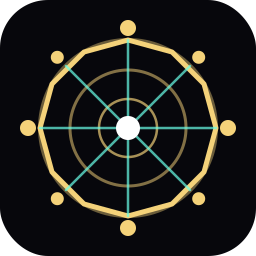
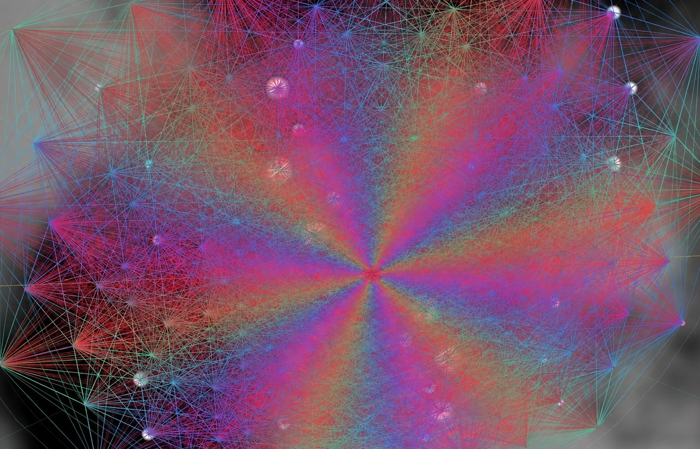

<p align="center">
  
</p>

<h1 align="center">E8 Studio</h1>

<p align="center">
  An interactive WebGL studio for exploring the E8 root system,<br>
  Platonic solids, the 600-cell, and regular four-dimensional polytopes.
</p>

<p align="center">
  <a href="https://github.com/agentcarlosian/e8-studio/actions/workflows/ci.yml"></a>
  <a href="https://github.com/agentcarlosian/e8-studio/actions/workflows/pages.yml"></a>
  <a href="LICENSE"></a>
  
</p>

<p align="center">
  <strong><a href="https://agentcarlosian.github.io/e8-studio/">Launch E8 Studio</a></strong>
  · <a href="#explore-e8-studio">Explore features</a>
  · <a href="#mathematical-visualization">Mathematical visualization</a>
  · <a href="https://github.com/agentcarlosian/e8-studio/issues">Issues</a>
</p>



## Explore E8 Studio

Click **Launch E8 Studio** and start exploring immediately. The hosted Studio runs entirely in the browser: no installation, account, sign-in, or upload is required. Your settings and learning progress stay in your browser.

### Six interactive views

| View | What it offers |
| --- | --- |
| **Bloom** | Watch a Platonic source shape pass through 600-cell-inspired stages and bloom into the E8 Coxeter projection. Animate the transformation and combine it with palettes, depth, and effects. |
| **Platonic** | Explore the five Platonic solids and four Kepler–Poinsot star polyhedra. Switch between wireframe and solid treatments, compare duals, and apply live twist, spike, and jitter deformations. |
| **E8 Coxeter** | Examine all 240 E8 roots in the Coxeter plane. Reveal the eight rings, edges, Petrie orbit, coordinate axes, Weyl mirrors, Cartan neighbors, projection modes, and mathematical color groupings. |
| **600-cell** | Rotate and inspect the 120 vertices of the regular 600-cell, highlight quaternion/conjugacy classes, compare structural subsets, and see its relationship to icosahedral symmetry. |
| **4D Polytope** | Move through all six convex regular 4-polytopes—from the 5-cell to the 120-cell. Rotate across six independent 4D planes and control the fourth-dimensional perspective depth. |
| **E8 SDF** | See the roots as a raymarched, illuminated structure with smooth-union geometry, edge connections, ambient occlusion, reflections, and the animated “Living E8” extrusion effect. |

### Shape the visual experience

E8 Studio is both an explorer and a generative visual instrument. You can:

- Choose from dozens of curated color palettes, including mathematically driven E8 color modes.
- Place the geometry in star fields, nebulae, galactic dust, deep-space fields, aurorae, grids, and other procedural backgrounds.
- Start with six outcome-oriented looks, then open **Advanced controls** for the complete effect, palette, background, lighting, and export catalogs.
- Apply view-aware shader effects: point and mesh views expose the full compatible catalog, while E8 SDF provides native Glow, Pulse, Heat, Iridescent, Hologram, and X-ray surface treatments.
- Animate individual sliders, extrusion, rotations, morphs, palette shifts, and camera movement.
- Use Orbit, Dive, and Spiral camera paths or take direct control with drag, scroll, and touch gestures.
- Start from gallery presets, move through them with previous/next controls, or use **Surprise** to discover unexpected combinations.
- Enter full-screen or minimal presentation mode for a clean art display.
- Use adaptive quality and reduced-motion safeguards on less powerful hardware.

### Capture, share, and export

The Studio is designed to produce work you can keep or use elsewhere:

- **Snapshot** saves the current render as a PNG exactly as it appears.
- **High-resolution PNG** captures a larger render; **Transparent PNG** removes the background for compositing.
- **Share** copies the clean hosted E8 Studio link once the project is running on GitHub Pages.
- **Video** records an animated WebM clip while the geometry, camera, palettes, and effects continue moving.
- **Postcard Studio** creates a vertical 9:16 composition with an editable caption for social sharing or presentation.
- **SVG** exports the E8 Coxeter diagram as editable vector artwork with the active structural coloring.
- **OBJ** exports the selected Platonic or star solid, including supported live deformations, for Blender, CAD, or 3D workflows.
- **JSON** exports canonical geometry and metadata for custom visualization, analysis, or teaching material.

Exports are generated locally. The hosted Studio does not require an account or send your render to a server.

### Learn while exploring

The educational system is integrated with the visual controls instead of being a separate textbook:

- Contextual essays explain the object or view currently on screen.
- Selection notes cover every Platonic solid, regular star polyhedron, and convex regular 4-polytope.
- Guided learning paths connect geometry, symmetry, E8 roots, the McKay correspondence, and signed-distance rendering.
- Quizzes provide explanations rather than only marking an answer right or wrong.
- A searchable glossary defines the mathematical language used throughout the Studio.
- Root picking reveals 8D coordinates, opposite roots, and Cartan-neighbor structure.
- A guided tour moves through views and readings automatically.
- Daily facts, biographies, a historical timeline, badges, and locally saved lesson progress reward deeper exploration.
- Source links and claim labels distinguish established mathematics, historical context, interpretation, and app-designed visualization.

### Getting around

- **Mouse:** drag to orbit, scroll to zoom, and click supported roots or structures for details.
- **Touch:** drag to orbit and pinch to zoom; the responsive control drawer keeps the render visible on smaller screens.
- **Keyboard:** use `1–6` for views, `Space` to pause, `S` for PNG, `T` for the tour, `G` for the glossary, `H` for presentation mode, and `Ctrl/⌘ + K` for commands.
- **Control search:** press `/` or use the filter field to find a setting without opening every section.
- **Reset and recovery:** camera and view resets stop conflicting animation drivers and return to a known pose.

## Mathematical Visualization

E8 Studio separates three things:

- **Established mathematics** — canonical root data, element counts, coordinates, Coxeter structure, and polytope relationships.
- **Interpretation** — carefully qualified visual connections, including the Studio’s presentation of the McKay correspondence.
- **Artistic visualization** — lighting, color, Bloom transitions, signed-distance materials, and other explanatory display choices.

Automated tests verify the 240-root E8 Weyl closure, Cartan relations, the eight-by-thirty Coxeter projection, Lie-bracket adjacency, Platonic Euler characteristics, regular 4-polytope counts, and educational-source coverage. The source ledger is maintained in [`src/content/sources.js`](src/content/sources.js).

## Run locally

Most visitors only need the hosted **Launch E8 Studio** link. The following instructions are for contributors, offline use, and custom builds.

### Requirements

- Node.js 20.19+ or 22.12+
- Python 3.12+

```bash
git clone https://github.com/agentcarlosian/e8-studio.git
cd e8-studio
npm ci
npm run dev
```

Vite prints the local development URL. Development source should be opened through the server rather than directly through `file://`.

## Build targets

```bash
npm run build:web          # Production GitHub Pages site → dist/web
npm run build:single       # Self-contained desktop HTML
npm run build:mobile       # Mobile/Capacitor build
npm run build:share        # Desktop and mobile standalone files
npm run electron:dist      # Desktop installers/packages
npm run release:artifacts  # Versioned bundle and checksums
```

Generated output is written to ignored `dist/` or `dist-app/` directories.

## Verification

Install the browser-test dependencies once:

```bash
python -m pip install -r requirements-dev.txt
python -m playwright install chromium
```

Run the release checks:

```bash
python scripts/verify.py
python scripts/test_robustness.py
python scripts/test_math.py
npm run smoke:mobile-v2
```

GitHub Actions runs release checks on Linux and core build/test contracts on Windows. Dependency updates are monitored by Dependabot.

## Architecture

```text
index.html              Desktop web entry
mobile.html             Dedicated mobile entry
src/
  views/                WebGL visualization modules
  math/                 E8 and polytope mathematics
  fx/                   Rendering effects and procedural backgrounds
  ui/                   Controls, palettes, essays, and themes
  state/                Camera, gallery, persistence, and progress
  services/             Export and recording orchestration
  mobile/               Mobile Canvas 2D application
data/                   Canonical and precomputed geometry
scripts/                Build, verification, and release tooling
electron/               Electron shell
android/                Capacitor Android project
```

The hosted application is bundled with Vite. Standalone, Electron, and mobile targets use separate verified build paths. See [`docs/architecture/build-boundaries.md`](docs/architecture/build-boundaries.md) for details.

## Platform support

- Modern desktop browsers with WebGL2
- Responsive touch-oriented desktop shell
- Dedicated mobile Canvas 2D interface
- Electron on desktop platforms
- Android through Capacitor

Performance varies by device and GPU. The WebGL SDF automatically selects a High, Balanced, or Low shader budget from device constraints while preserving all 240 roots through the compact eight-ring representation. Changing the quality control recompiles that budget immediately. Effects declare their compatible views and approximate GPU cost, so unavailable or overly expensive combinations are not presented as active controls. Adaptive resolution, reduced-motion handling, and animation recovery provide additional fallbacks.

## Contributing

Focused bug reports and improvements are welcome. Read [`CONTRIBUTING.md`](CONTRIBUTING.md) before opening a pull request. Please report vulnerabilities privately according to [`SECURITY.md`](SECURITY.md).

- [Report a bug](https://github.com/agentcarlosian/e8-studio/issues/new?template=bug_report.yml)
- [Request a feature](https://github.com/agentcarlosian/e8-studio/issues/new?template=feature_request.yml)

## Acknowledgments

The project draws on standard references for E8, Coxeter-plane projections, regular polytopes, the McKay correspondence, and sphere tracing. Full citations are maintained in the application’s source registry.

The generative control-panel format was inspired in part by Asobo Design’s DESIGN ≠ FORMULA. E8 Studio is an independent implementation and shares no code with that project.

## License

E8 Studio is available under the [MIT License](LICENSE). © 2026 Carlosian.
