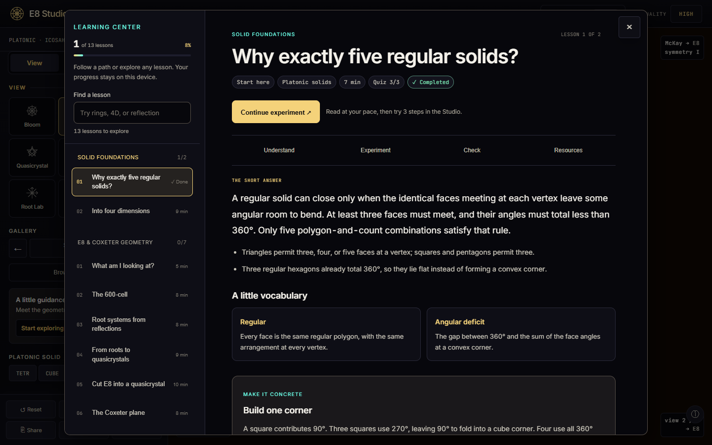
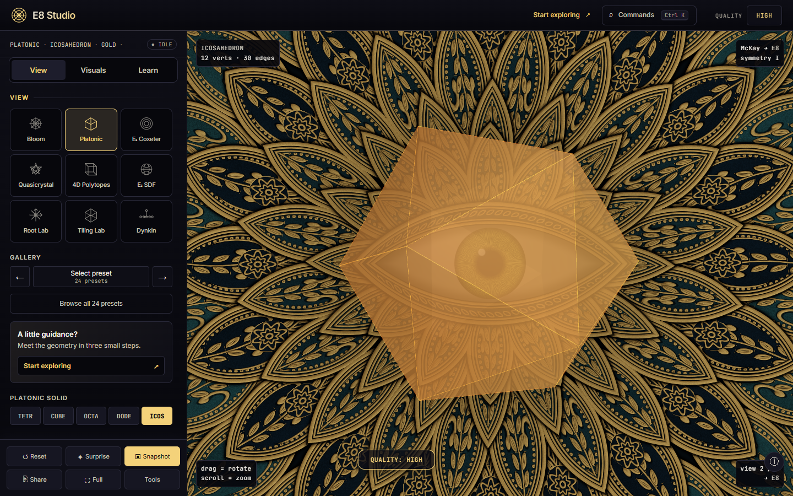
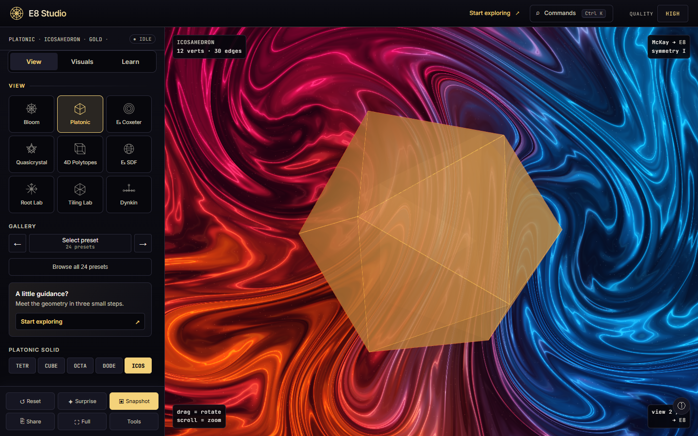
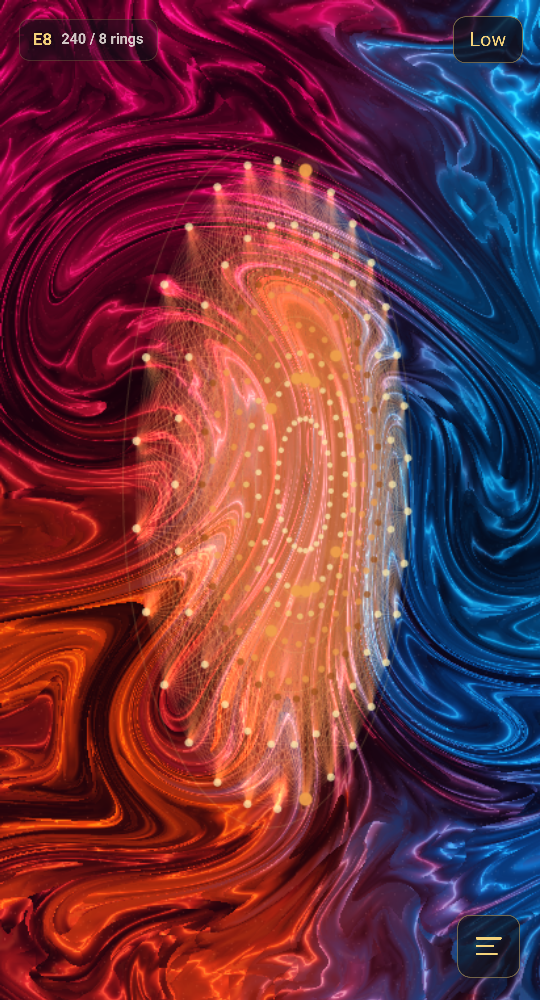

# September 2026 pre-PR review

The changes are prepared as a three-branch stack. Review and merge them in this
order; each branch builds independently. No branch has been pushed by this review.

| Branch | PR base | Scope |
| --- | --- | --- |
| `codex/reliability-build-ci` | `main` | Scene persistence, geometry exports, mobile state modules, build parity, and deployment gated by Linux and Windows checks |
| `codex/studio-learning-ui` | `codex/reliability-build-ci` | Studio navigation, quick start, guided lessons, experiments, quizzes, and saved progress |
| `codex/background-rendering` | `codex/studio-learning-ui` | Procedural backgrounds, mobile fallbacks, Tide quality policy, canvas label contrast, and rendering/journey verification |

The stack starts at `4fd2ed3` (the fetched `origin/main` baseline). The local `main`
checkout is older; use the PR bases above rather than comparing against that stale
local branch. CI checks pull requests targeting any branch. Deployment remains
restricted to verified `main` pushes or manual runs.

## Changes made during preflight

- The canonical verifier now runs all 30 desktop background cases, mobile motion
  and reduced-motion checks, fallback checks, and the integrated release journey.
  CI invokes it through `npm run release:check`.
- Detailed Tide requires High quality on desktop. Low and Medium select Void;
  legacy Grid scene links follow the same policy. Mobile Low keeps animated Tide
  using the Canvas fallback without initializing its WebGL renderer.
- Canvas labels have a dark backing for readability over bright backgrounds.
- Hardware benchmark scripts distinguish animation callbacks from actual rendered
  frames, and the desktop benchmark rejects software rendering.

## Verification evidence

The reliability branch passed its 11-stage verifier. The learning/UI branch
passed its 12-stage verifier. Both also built the mobile standalone artifact and
passed root-file, desktop standalone, and mobile standalone boot tests. A later
CI-only change enabled checks on stacked PR bases; it did not change application
code. The final branch uses the complete 13-stage verifier inside the clean-commit
release check.

The integrated browser journey passed: complete a lesson, run an experiment,
record an observation, pass its quiz, reload saved progress, download OBJ and PNG,
and restore the scene in a fresh browser context. Scene sharing did not include
personal learning progress. The dedicated Mobile V2 smoke suite also passed.

### Hardware measurements — September 6, 2026

These short samples were taken from the pre-commit working tree based on
`4fd2ed3`, after the background and Tide changes. They characterize those visuals;
they are not long-duration thermal, battery, or cross-device guarantees.

| Workload | Device / renderer | Actual rendered FPS |
| --- | --- | --- |
| Dense E8, 1440 × 900, DPR 1, High; Void, Mandala, Plasma, Quantum, Tide | Windows, AMD Radeon 890M, ANGLE D3D11 | 60.0–60.4 |
| E8 mobile shell, Low; same five backgrounds | Physical Pixel 10a, Android 17, Chrome 152, Mali-G715 | 29.9–30.2 |
| E8 mobile shell, High; same five backgrounds | Same physical Pixel 10a | 29.9–30.2 |

Desktop rendered 22,902 lines and 241 foreground points; Quantum added 64,000
orbital points. Desktop samples were three seconds after a 1.5-second settling
period. Phone samples were five seconds after two seconds of settling, at a
411 × 761 CSS-pixel viewport and DPR 2.625. The mobile shell targets 30 FPS;
its roughly 60 animation callbacks per second must not be reported as 60 rendered
FPS. No JavaScript errors were observed during these workloads.

The phone was USB-powered throughout. Reported battery temperature changed from
31.8°C to 32.1°C during the short run; battery drain was not measurable while
charging. Safari remains untested because no iPhone, iPad, or Mac was available.

### Reproduce

```sh
npm run release:check
npm run smoke:mobile-v2
python scripts/benchmark_backgrounds.py
python scripts/benchmark_android.py --serial YOUR_AUTHORIZED_DEVICE
```

Run the release check from a clean commit. Run builds and mobile smoke tests
sequentially: they share the `dist/` output directory. Hardware benchmarks need
Playwright Chromium; Android also requires adb and a phone with authorized USB
debugging. Reports and raw captures are written to the ignored
`smoke_shots/pr-preparation/` directory. The Android runner can optionally leave a
running local mobile app open with `--review-url http://127.0.0.1:5176/mobile.html`.

## Visual review

These are captures of the implemented application. The user-provided reference
photos are not embedded as background assets.

Learning center after a completed quiz:



Mandala and Plasma behind an interactive solid, with readable canvas labels:





Plasma on the physical Android phone at Low quality:


